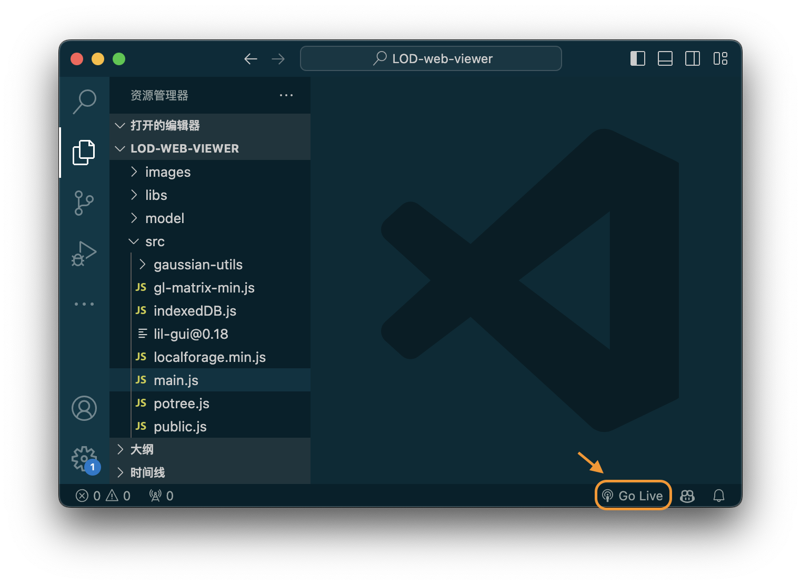
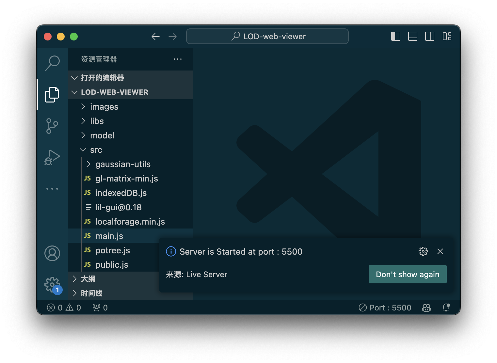
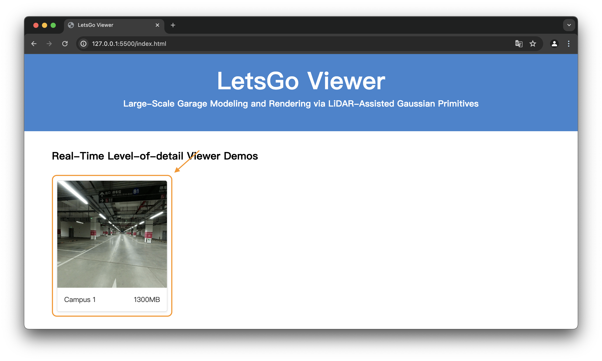
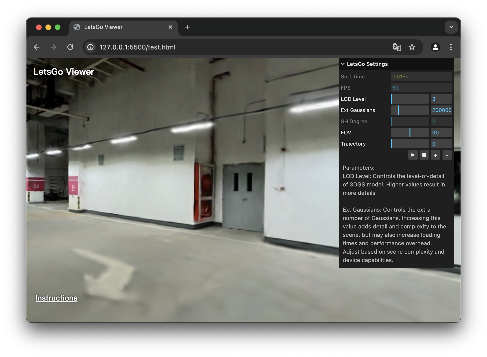

# LOD Web Viewer for LetsGo

## LetsGo: Large-Scale Garage Modeling and Rendering via LiDAR-Assisted Gaussian Primitives

Jiadi Cui\*, Junming Cao\*, Fuqiang Zhao\*, Zhipeng He, Yifan Chen, Yuhui Zhong, Lan Xu, Yujiao Shi, Yingliang Zhang†, Jingyi Yu†

[Project page](https://zhaofuq.github.io/LetsGo/) | [Paper](https://arxiv.org/pdf/2404.09748) | [Video](https://www.youtube.com/watch?v=fs42UBKvGRw) | [LOD Viewer (SIBR)](https://zhaofuq.github.io/LetsGo/) | [Web Viewer](https://zhaofuq.github.io/LetsGo/)| [GarageWorld Dataset](https://zhaofuq.github.io/LetsGo/) <br>

We provide a web renderer to allow users to experience a scene with Level of Detail (LOD) Gaussian rendering. For users with a computer, the application can be run directly. However, for users with an iPad (preferably with an M- chip), you need to start the server on a computer and ensure that both the iPad and the computer are on the same local network to access it.


## Setup

#### Install requirements (For mainstream computer OSs)

- [**Chrome**](https://www.google.com/chrome/)

- [**Visual Studio Code**](https://code.visualstudio.com/download) (to start the server)
  - And [**Live Server extension**](https://marketplace.visualstudio.com/items?itemName=ritwickdey.LiveServer)

- Or 
- [**Node.js**](https://nodejs.org/en/download/package-manager) and [**NPM**](https://docs.npmjs.com/getting-started) (to start the server)
  - And [**Live server**](http://tapiov.net/live-server/)


#### Install requirements (For iPadOS)

- [**Chrome**](https://www.google.com/chrome/)

#### Clone the repo

Checkout this repository's main branch:

```sh
## through HTTPS
git clone https://github.com/NeuDimlabs/LOD-3DGS-Viewer.git
## through SSH
git clone git@github.com:NeuDimlabs/LOD-3DGS-Viewer.git
```

#### Download the data

```sh
cd LOD-web-viewer/model
## download ...
...
```

## To run an example

#### Start with VSCode

Use VSCode to open the folder:

```
cd {your-folder}/LOD-web-viewer/
code .
```

Go Live,





Then, open Chrome on the computer and visit the server, usually at `127.0.0.1:5500`.

#### Start with NPM

Run it in the terminal:

```
your-name@your-computer:{your-folder}/LOD-web-viewer$ live-server
Serving "{your-folder}/LOD-web-viewer" at http://127.0.0.1:8080
...
```

Then, open Chrome on the computer and visit the server at `127.0.0.1:8080`.

#### Visualization on computer





It is recommended to use the `WASDQEIJKL` keys for moving the view horizontally,vertically, forward, backward, and side to side. Click on the webpage using your mouse or touchpad to refresh the view with more details.

#### Visualization on iPad

First, obtain your computer's IP address. 

Then, open Chrome on the iPad and visit the server at `192.168.xxx.xxx:{your-port}`.

# Citation

If you find our code or paper helps, please consider citing:
<section class="section" id="BibTeX">
  <div class="container is-max-desktop content">
    <pre><code>@article{cui2024letsgo,
        title={LetsGo: Large-Scale Garage Modeling and Rendering via LiDAR-Assisted Gaussian Primitives},
        author={Jiadi Cui, Junming Cao, Fuqiang Zhao, Zhipeng He, Yifan Chen, Yuhui Zhong, Lan Xu, Yujiao Shi, Yingliang Zhang, Jingyi Yu},
        journal={arXiv preprint arXiv:2404.09748},
        year={2024}
    }
</code></pre>
  </div>
</section>

## Troubleshooting

#### Bugs and Issues


# Acknowledgements


